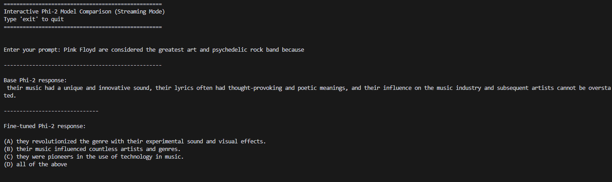
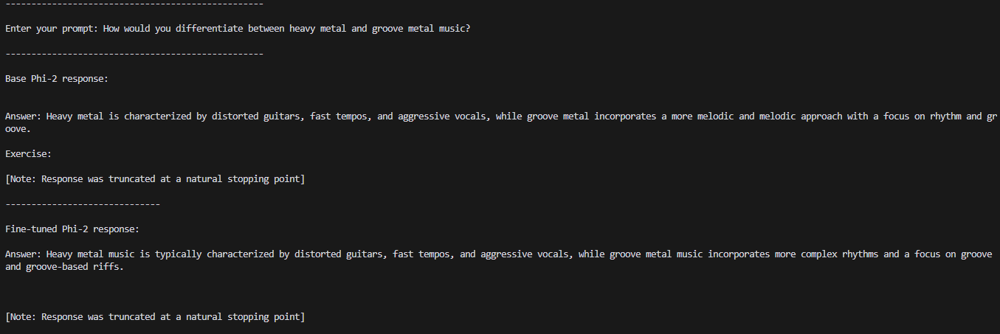

# Phi-2 Fine-tuned Assistant

## Overview

This project fine-tunes Microsoft's Phi-2 model (2.7B parameters) on the Open Assistant dataset using General Reward-based Policy Optimization (GRPO) to create a helpful, instruction-following assistant. GRPO is a novel fine-tuning approach developed by DeepSeek that combines the benefits of RLHF (Reinforcement Learning from Human Feedback) and DPO (Direct Preference Optimization) while addressing their limitations. Unlike traditional methods, GRPO directly optimizes policy using preference data without requiring a separate reward model, making it more efficient and effective for aligning language models with human preferences.

The fine-tuned model maintains Phi-2's efficiency while significantly improving its ability to follow instructions and engage in helpful dialogue.

## Features

* Efficient Model: Based on Microsoft's Phi-2 (2.7B parameters)
* Fine-tuned with GRPO: Trained using preference data from Open Assistant
* Low Resource Requirements: Can run on consumer hardware with 4GB+ VRAM
* Interactive Chat Interface: Streamlit-based UI for easy interaction
* Token Streaming: Responses appear word-by-word for a natural experience

## Technical Details

### Preprocessing the Dataset

The Open Assistant dataset (oasst1) was preprocessed to create preference pairs suitable for GRPO training:

1. Messages were grouped by conversation tree ID
2. For each conversation, we identified the initial prompt
3. Direct replies to the prompt were collected and ranked based on:
   - Explicit ranking information when available
   - Like count as a fallback metric
4. Preference pairs were created with:
   - The original prompt
   - The highest-ranked response as the "chosen" completion
   - The lowest-ranked response as the "rejected" completion
5. The dataset was limited to 1,000 high-quality preference pairs to optimize training efficiency

This preprocessing approach ensures that the model learns from genuine human preferences about response quality.

### Model Architecture

* Base model: Microsoft Phi-2 (2.7B parameters)
* Fine-tuning method: QLoRA (Quantized Low-Rank Adaptation)
* LoRA parameters: 7,864,320 trainable parameters (0.28% of base model)
* LoRA configuration:
  * Rank (r): 16
  * Alpha: 32
  * Target modules: Attention (q_proj, k_proj, v_proj, o_proj) and MLP (gate_proj, up_proj, down_proj)
* Quantization: 4-bit precision (NF4)
* Training dataset: Open Assistant (oasst1)

### Training Process

The model was fine-tuned using GRPO with the following parameters:
* LoRA rank: 16
* Learning rate: 5e-6
* Batch size: 2 (with gradient accumulation steps of 4)
* Training epochs: 1
* Warmup ratio: 0.1
* Optimizer: AdamW with cosine learning rate schedule
* Gradient checkpointing: Enabled for memory efficiency

### Performance

The fine-tuned model shows improved performance in:

* Following complex instructions
* Maintaining helpful and safe responses
* Generating coherent and contextually appropriate text
* Providing more concise and relevant answers compared to the base model

## Sample comparisons 

The following images show sample outputs of the base model and the fine tuned model, where the difference in tone and structure of the answer can be seen. As the model was only trained with 1000 samples, it still has significant room to improve its responses, but the difference already shows a POC. 

### Sample 1

The fine tuned model gives a more structured response here. 

### Sample 2

The fine tuned model gives a more accurate definition of groove metal, which has nothing to do with melodic elements as seen in the base model's response! 
